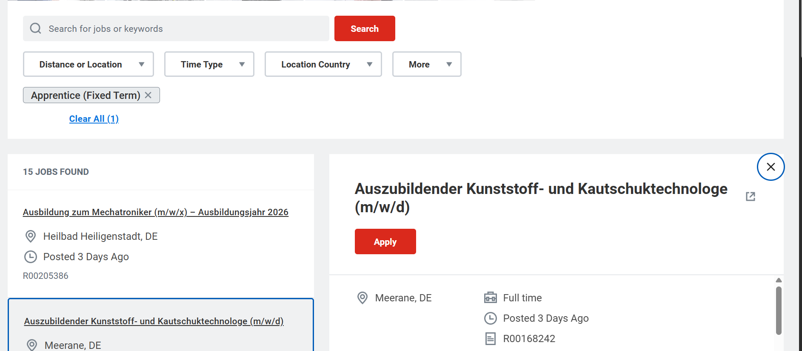

# Job Application Tracker Tool (Web Browser Extension)

A lightweight Chrome extension that helps you track your job applications directly from job listing pages on LinkedIn, company websites, or job boards — all with a single click.

 
> 📌 Latest `version_1.2` is now live! Includes clickable job URLs, improved popup syncing, and better CSV export. (Stable and Recommended)
> [Click here to view the latest version_1.2 in the  `version_1.2` branch](https://github.com/SushantChoraghe/job-application-tracker-chrome-extension/tree/version_1.2)

>  `version_1.1` is now live!   
> [Click here to view the version_1.1 in the `version_1.1` branch](https://github.com/SushantChoraghe/job-application-tracker-chrome-extension/tree/version_1.1)

---

## Features

- Extracts job title, company name, and location from job listing pages
- Auto-fills job info into the pop-up
- Edit entries anytime using the **"Edit All"** toggle in the View page
- Status dropdowns with colour-coded stages (Application, Interview, Offer, Rejected)
- Data saved locally using Chrome Storage
- **Export to CSV** from the View Applications page
- Works 100% offline — no sign-in needed  

---

## How to Use This Extension from GitHub (No Chrome Web Store Needed)

You can use this Chrome Extension manually without installing it from the Chrome Web Store:

### 1. Download the Extension or Fork the Repository

- **Download Option:**
  - Go to [job-application-tracker-chrome-extension](https://github.com/SushantChoraghe/job-application-tracker-chrome-extension)
  - Click the green **"Code"** button → **"Download ZIP"**
  - Unzip the file to a folder on your computer

- **Fork Option (no need to download):**
  - Click the **"Fork"** button at the top-right corner of the repository
  - This will create a copy in your own GitHub account
  - You can then clone and work on your own version anytime

### 2. Load It in Chrome

- Open Chrome and go to: `chrome://extensions`
- Enable **Developer Mode** (top right toggle)
- Click **"Load unpacked"**
- Select the folder you just unzipped

The extension will now appear in your Chrome toolbar.

### 3. Use the Extension

- Open a job page on a company’s site
- Click the extension icon
- Fill or verify job fields → Save
- Click **“View Applications”** to see, edit, or export your saved jobs  

Note: **Download CSV** is now available on the **View Applications** page only

### To Uninstall

- Go to `chrome://extensions`
- Find the “Job Application Tracker Tool”
- Click **Remove**

---

## How to Update the Extension

If you're already using the extension and want to update to a new version:

1. Open `chrome://extensions`  
2. Remove the old version of the extension  
3. Delete the old folder from your computer  
4. Download or clone the updated version  
5. Click **"Load unpacked"** again and select the new folder

**Your saved job list will NOT be deleted.**  
Chrome stores your data separately, so your saved applications will still be available after updating.

---

## Important Notes

🔹 This extension works on all **company websites**' job listings  
🔹 **Job boards** like LinkedIn, Indeed, Glassdoor, etc.  
🔹 Make sure to **open the full job listing** (not just side/preview panel)

Example of a preview panel that won’t work:

Instead, open the full job post before using the extension.

---

## Fields Tracked

- Company Name
- Job Title
- Location
- University Name (optional)
- Documents Sent (CV, Cover Letter, etc.)
- Status (Applied, Interview, Rejected, etc.)
- Application Date
- Job URL

---

## Built With

- HTML, CSS, JavaScript
- Chrome Extensions API (Manifest v3)
- Chrome Storage API
- CSV Blob generation for export

---

## Contributing

Have an idea to improve this tool?  
Want to enhance its features, improve the code quality, or test it across different sites?

**Feel free to open an issue, suggest a feature, or submit a pull request!**  
All contributions — big or small — are welcome and appreciated.

---

## License

This project is licensed under the MIT License.

---

## Contact

Built with ❤️ by Sushant Choraghe (https://www.linkedin.com/in/sushantchoraghe)

Feel free to connect or drop suggestions!

---

